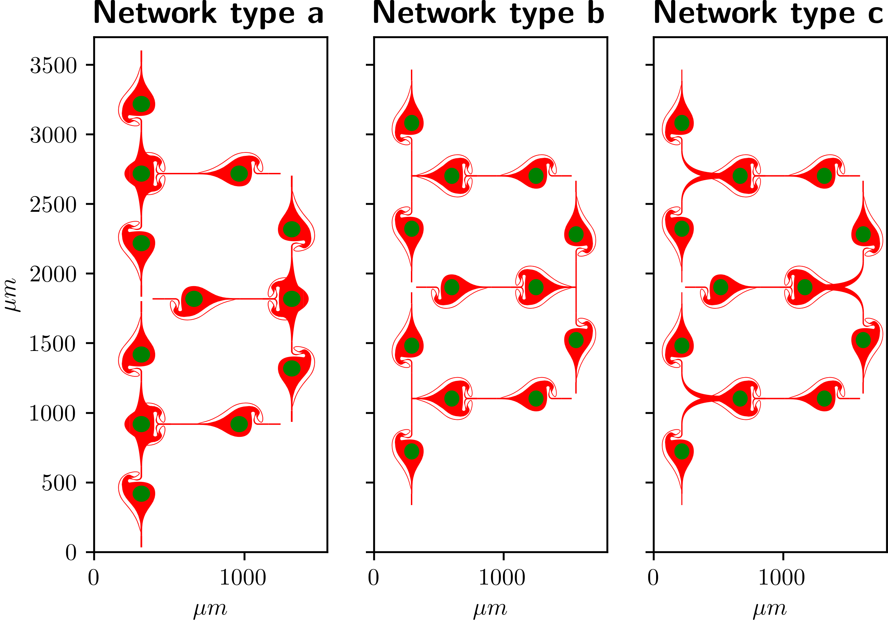

# Well Defined Neural Networks on High-Density Multielectrode-Arrays code

This repo (Python) contains code for pre-processing and analyzing neural data acquired with high-density multielectrode arrays
* `Modules` contains classes for loading the raw data and metadata into attributes of one instance
and a spike detection script which detects positive threshold crossings.
* `Locate_PDMS/voltage_maps.py` contains a workflow to scan a sequence of recording
configurations across the array while applying a sinusoidal voltage signal (30mVpp
at 1 kHz) through the chip’s reference electrode. The workflow is embedded in
a simple graphical user interface, whch also allows for interactively annotating
sets of electrodes.
* **Recording scripts**: A collection of Python scripts to record extracellular
spiking activity and stimulation of neurons using the HD-MEA platform (MaxOne, 
MaxWell Biosystems, Basel).
* **Data_analysis**: A collection of jupyter notebooks to explore neural data from HD-MEAs.
    * Grid of electrodes (141 traces) showing extracellar activtiy of two neurons.
    * Code to produce the video in `AVI_maker.ipynb`.

* `gdsCAD/four_node_networks_cad.ipynb` is a jupyter notebook to create the CAD-files
of our four-node networks. The script uses the Python package gdsCAD.
    * CAD design of the engineered network-types

* `Spyking_circus/probe_param_file_generator.py` automatically generates probe-files
required to run the SpyKING CIRCUS algorithm for spike sporting.
* `IDS_cam/Stitching.py` makes a grid scan of 7 by 7, square 550 μm by 300 μm pictures
to capture the entire electrode array using a CCD camera and the Python package ids.